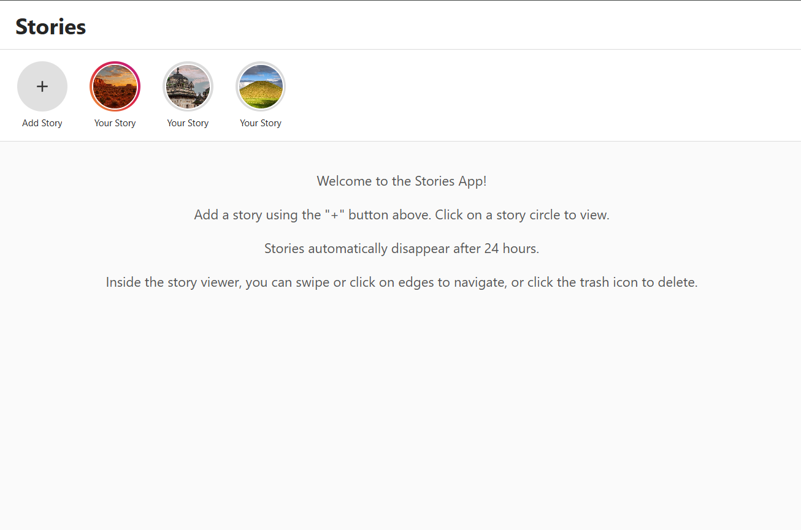

# 📸 24hr Story Feature

A client-side Instagram-like "Stories" feature built using React, where users can create, view, and interact with stories that automatically expire after 24 hours.

## 🌐 Live Demo

👉 https://stories-feature-steel.vercel.app/

## 🚀 Features

* Create and view stories with auto-play
* Stories expire automatically after 24 hours
* Swipe / click navigation between stories
* Visual indicators for viewed/unviewed stories
* Data persistence using LocalStorage
* Fully responsive UI

## 🛠 Tech Stack

* React.js
* JavaScript (ES6+)
* CSS3
* Vite
* LocalStorage API

## 📸 Preview

## 💡 What I Learned

* Managing state in React using hooks
* Building interactive UI components
* Handling time-based data (24hr expiry logic)
* Improving UX with animations and navigation

## 📌 Inspiration

Inspired by the Instagram Stories feature and built as a frontend challenge project.
